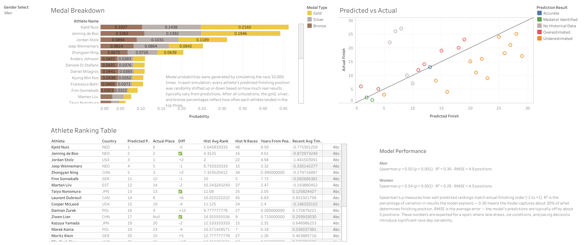
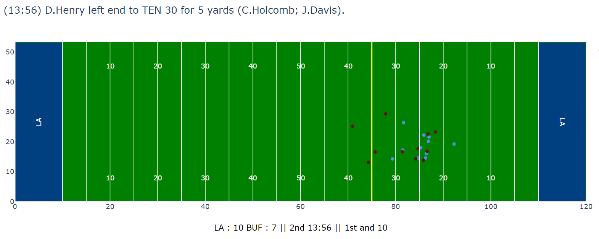
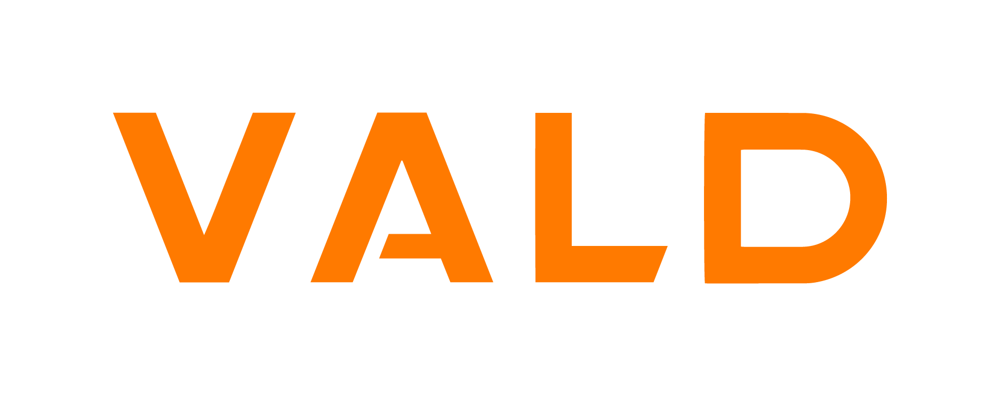

# Carter Taffe
### Sports Data Scientist

I work at the intersection of sport and data. In my day-to-day with **UC San Diego Athletics**, I operate **Teamworks AMS**, surfacing performance and athlete-monitoring data from platforms like **VALD** and **OpenField** so coaches and high-performance staff can see what matters, when it matters. In **Fall 2026 I'm starting an MS in Data Science & Statistics at UC San Diego's Halıcıoğlu Data Science Institute (HDSI)**.

Outside of work, I build sports data science projects in domains that interest me.

---

## Featured Projects

### [Olympic Speed Skating Medal Prediction](https://github.com/quincy928/2026-Olympic-Speed-Skating-Prediction)
A predictive model for the 2026 Winter Olympic 1000m speed skating event, built from a decade of International Skating Union race data.
- Engineered an end-to-end pipeline that **correctly identified all six 2026 medalists (men's and women's) as top-five contenders**, with a statistically significant rank correlation against the actual Olympic results.
- Paired an OLS rank model with a **10,000-run Monte Carlo simulation** to express medal odds and uncertainty in terms staff understand — *"Leerdam medals in 65% of our simulations"* rather than a raw coefficient.
- Drove performance through **domain-informed feature engineering** — venue-effect normalization, recency weighting, and athlete-ID tracking — validated with a leakage-free temporal split.
- Delivered the forecasts as an **interactive Tableau dashboard** for coaches to explore the field and filter athletes.

[View the interactive dashboard →](https://public.tableau.com/app/profile/carter.taffe/viz/2026OlympicSpeedSkatingPredictions/Dashboard1)

### [NFL Big Data Bowl 2024](https://github.com/quincy928/BDB-2023)
A tackle-prediction project built on NFL player tracking data.
- Applied advanced preprocessing to high-frequency player tracking data using pandas and NumPy.
- Developed and tuned regression, random forest, and boosting models alongside feed-forward neural networks to predict tackle success.
- Built animated football plays from tracking data with Plotly to make the analysis intuitive and presentation-ready.

### [VALD API Integrations](https://github.com/quincy928/vald_api_pulls)
A data-engineering tool that streamlines force-plate and athlete-monitoring data access for the UCSD Sports Science team.
- Built a script that automatically populates and organizes athlete data pulled from VALD's external APIs, cutting manual retrieval time for the staff.
- Worked directly with strength coaches to identify the performance metrics that mattered to them, ensuring the output mapped to real reporting needs.
- Collaborated with VALD's technical support to understand the API structure and integrate the right data cleanly.

---

## Other Projects
- [Predicting Voter Behavior from Census Data](https://github.com/quincy928/Voter-Behavior) — classification and unsupervised learning on demographic data in R, with ROC comparison and a team report.

---

## Skills
- **Languages:** Python, R, SQL, SAS
- **Libraries:** pandas, NumPy, scikit-learn, Keras, TensorFlow, Matplotlib
- **Tools:** Tableau, BigQuery, Google Cloud Platform, Docker, Git/GitHub, Kaggle, Excel, bash

## Education
- **MS, Data Science & Statistics** — UC San Diego, Halıcıoğlu Data Science Institute (HDSI) *(starting Fall 2026)*
- **BS, Data Science & Statistics** — UC Santa Barbara (2023)
  - Relevant coursework: Regression Analysis (R), Statistical Machine Learning (R), Statistical Data Science (Python), Big Data Analytics (Python)

## Experience
- **Sports Science Data Scientist** — UC San Diego Athletics
  - Operate Teamworks AMS to surface athlete-monitoring and performance data from VALD, OpenField, and related platforms for coaches and high-performance staff.
- **AI Prompt Engineer / Data Labeller** — Scale AI

---

## Contact
Always happy to talk sport, data, or both.

[GitHub](https://github.com/quincy928) | [LinkedIn](https://www.linkedin.com/in/carter-taffe/) | cquincy928@gmail.com
